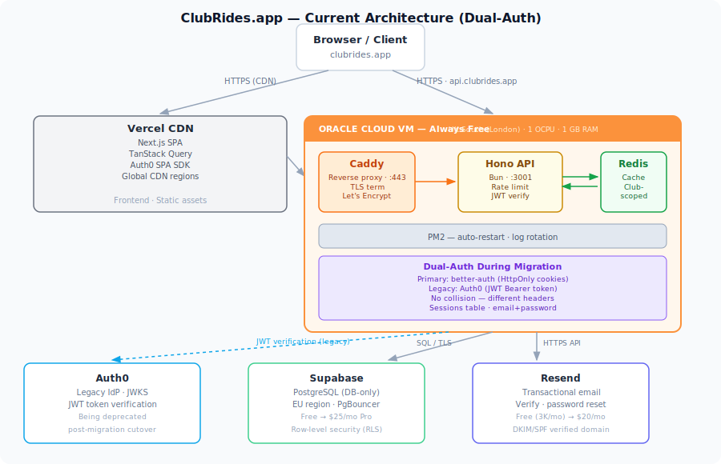

# ClubRides.app — Scaling Overview

## Current System

**Domain:** `api.clubrides.app` (DNS on Cloudflare)
**Auth:** better-auth, HttpOnly cookies, email+password
**Frontend:** static SPA served from VPS `/public`

---

## Current Usage

| Metric               | Value                       |
| -------------------- | --------------------------- |
| Active clubs         | 1 (BCC — Bath Cycling Club) |
| Members              | ~400                        |
| Monthly active users | ~200                        |
| DB storage           | < 50 MB                     |
| Monthly emails       | < 200                       |

---

## Free Tier Runway (~15 Clubs)

The Oracle Cloud Always Free VM is free indefinitely, but 1 GB RAM hosts Redis, Hono, Caddy, and PM2 on a single machine. At ~15 clubs (~1,500 users) this becomes the binding constraint:

| Service   | Free Limit                | ~15 Club Pressure                  |
| --------- | ------------------------- | ---------------------------------- |
| Oracle VM | 1 GB RAM (free forever)   | Redis + API + peak load → OOM risk |
| Supabase  | 500 MB DB · 50K MAU       | Comfortable — well under           |
| Resend    | 3,000 emails/mo · 100/day | Hit during onboarding bursts       |
| Sentry    | 5K errors/mo              | Comfortable                        |

**Trigger point:** ~15 clubs is when the VM should be upgraded to a paid 4 GB instance (~£24–32/mo) and Redis moved off-box. Everything else stays within free tiers until ~50+ clubs.

---

## Multi-Tenancy: Required Changes & Costs

The core multi-tenancy architecture is **already implemented** (clubs, user_clubs, clubId scoping, resolveClub middleware, X-Club-Id routing). Outstanding work is primarily operational.

### Service Costs at Full Scale (1,500 clubs · 150K users)

| Service    | Provider            | Cost/mo       | Notes                                       |
| ---------- | ------------------- | ------------- | ------------------------------------------- |
| VPS        | Oracle Cloud (paid) | £47–79        | 4–8 GB VM; or add second free Ampere ARM VM |
| Database   | Supabase Pro        | ~£79          | DB-only mode, no auth overhead              |
| Cache      | Upstash Redis       | £16–39        | Managed, club-scoped keys                   |
| Email      | Resend              | £16–39        | Verification + password reset volume        |
| Monitoring | Sentry              | £0–21         | Free tier likely sufficient                 |
| Domain/DNS | Cloudflare          | ~£12          | Wildcard cert for `*.clubrides.app`         |
| **Total**  |                     | **~£180–270** |                                             |

> The largest single cost lever is Supabase. Migrating to a self-hosted Postgres (e.g. on a second Oracle Ampere free VM) would cut ~£79/mo but adds operational burden.

### Technical Work Remaining

**Infrastructure**

- Move Redis off the API VM (Upstash or second VM)
- Caddy On-Demand TLS for per-club subdomains (`<slug>.clubrides.app`)
- Wildcard DNS `*.clubrides.app → VM IP`
- `/validate-domain` endpoint to gate cert issuance

**Application**

- Club self-service onboarding (create club, invite members, set branding)
- Per-club email sender identity or shared `noreply@clubrides.app`
- Admin dashboard: usage metrics, club management, billing hooks
- Bulk cron loop across all clubs (already designed; needs testing at scale)

**Data**

- Schema migration: `bcc_` prefix removal (phase 0 — largely done)
- Data import tooling for clubs migrating from other platforms

---

## Technical Challenges

| Challenge               | Risk                                                     | Mitigation                                                      |
| ----------------------- | -------------------------------------------------------- | --------------------------------------------------------------- |
| Tenant data isolation   | High — missing `clubId` predicate = cross-club data leak | Drizzle enforces at query layer; lint rule + code review        |
| 1 GB RAM ceiling        | Medium — OOM kills PM2 process                           | Upgrade VM before ~15 clubs; move Redis off-box                 |
| Connection pooling      | Medium — 1,500 clubs × concurrent requests               | Supabase PgBouncer handles this; monitor connection count       |
| Cache invalidation      | Low — stale data across clubs                            | Keys are club-scoped; `clubCachePattern(clubId)` for bulk purge |
| On-Demand TLS abuse     | Low — cert issuance rate-limited by Caddy                | `/validate-domain` endpoint with 2-min interval, 5-cert burst   |
| Single point of failure | Medium — one VM hosts everything                         | Oracle Cloud SLA 99.9%; PM2 auto-restart; Caddy persists certs  |

---

## Non-Technical Challenges

### Support

At 1,500 clubs there is no realistic path to per-club support without automation. Club admins need self-service tools for password reset, member management, and ride configuration. Expect 1–3 support requests per club per year at steady state — a ticketing system (e.g. Linear, Helpscout) will be needed before ~50 clubs.

### Data Protection (UK GDPR)

The platform processes personal data (names, emails, ride participation) for club members who have not directly consented to a relationship with ClubRides.app. This requires:

- A **Data Processing Agreement (DPA)** between ClubRides.app and each club (club is data controller, ClubRides.app is processor)
- A published **Privacy Policy** covering data categories, retention periods, lawful basis, and sub-processors (Supabase, Resend, Sentry)
- A **right to erasure** flow — deleting a user must cascade across all clubs and purge cached data
- A **data retention policy** — rides/memberships for inactive clubs
- Registered with the ICO as a data processor (£40–60/yr)

### Freedom of Information

Not applicable — ClubRides.app is a private platform, not a public authority. Individual cycling clubs may have their own FOI obligations if they receive public funding, but the platform has no direct exposure.

### Privacy Policy & Terms of Service

Two distinct documents are needed before onboarding external clubs:

- **Terms of Service** — governs club admins (account, acceptable use, payment terms, termination, liability cap)
- **Privacy Policy** — governs end users (what data, why, how long, who sees it, how to request deletion)

Both need a solicitor review before launch. Key points to cover: jurisdiction (England & Wales), limitation of liability, no SLA guarantee at this price point, club admin responsibility for their members' data.

### Billing & Payments

No revenue model is currently in place. Options before launch:

- **Free for small clubs** (< 50 members), paid tier above — requires Stripe integration and entitlement checks in the API
- **Annual flat fee per club** — simpler; invoiced manually until ~20 clubs, then automated

Without a billing model, the £180–270/mo infrastructure cost at full scale is unrecovered.
